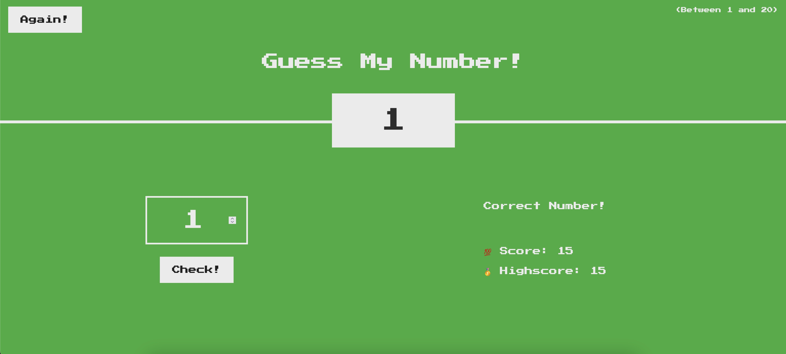
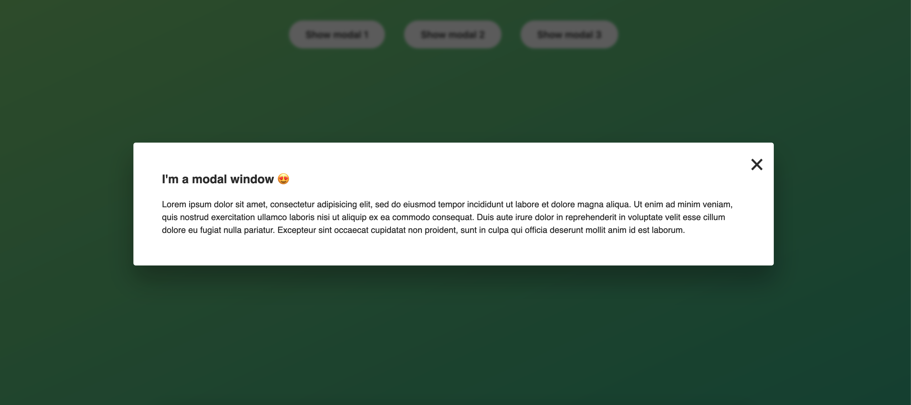
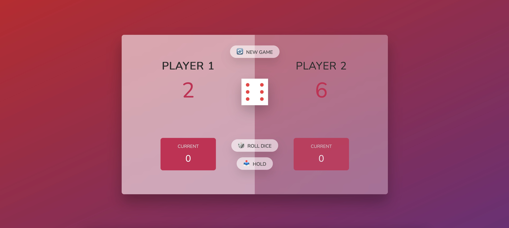
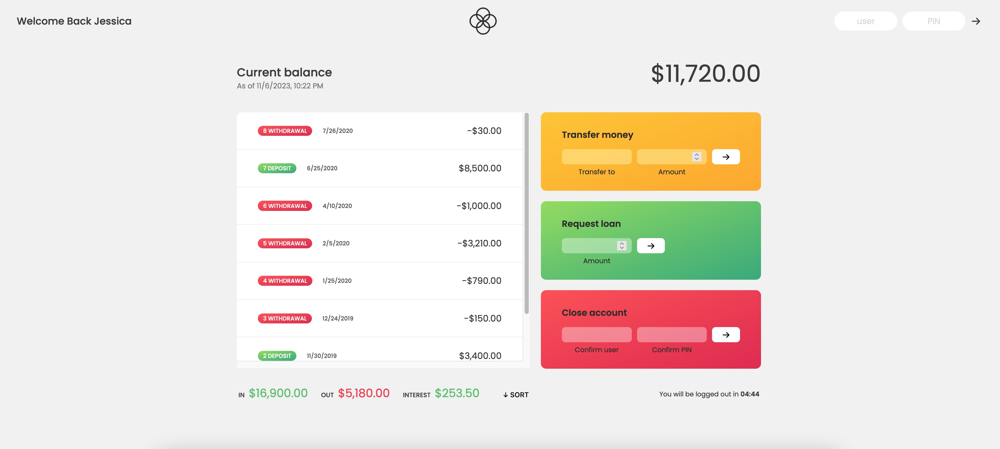
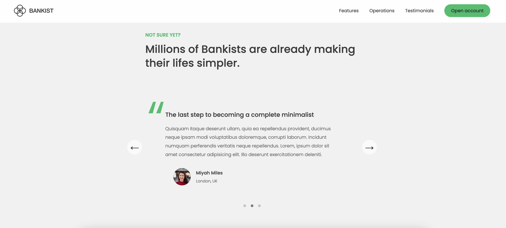
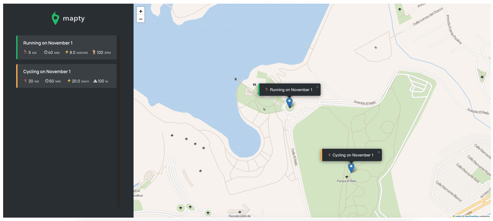
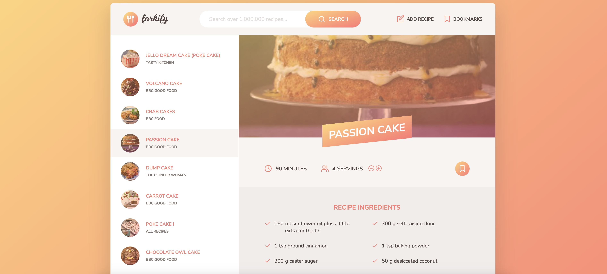

# Code along JavaScript [Udemy course](https://www.udemy.com/share/101Wfe/) projects.

## Guess Game

Number guessing game.

## Modal

Modal windows.

## Dice game

Pig - dice game.

## Simple Bank app

Simple banking application (User: jd, PIN: 2222). With the following features:

- Login.
- Automatic logout after 5 minutes.
- Transfer money.
- Close account.
- Request loan.
- Sort transactions.

## Bank website

Main features:

- Lazy loading images.
- Sticky nav bar.
- Slider.
- Tabbed component.

## Map app

Application to keep track of training (running and cycling), using Leaflet (a JavaScript library for interactive maps).

## Recipe app

Recipe Application. With the following features:

- Search recipes (through an API).
- Pagination.
- Bookmarks.
- Modify servings.
- Add a recipe using a token/key.

